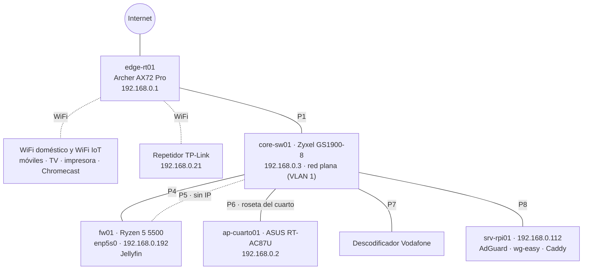

# Fase 0 · Línea base

| | |
|---|---|
| **Fecha** | 2026-09-25 |
| **Autor** | Jesus-JAR |
| **Estado** | Cerrada |
| **Alcance** | Estado real de la red antes de segmentarla (*as-is*), hallazgos, cambios previos y medidas de referencia |

> Versión pública saneada: sin direcciones MAC, IP pública ni dominio. Los datos completos y las copias de configuración están en el repositorio privado, cifradas con GPG.

## 1. Resumen

Red doméstica plana `192.168.0.0/24`, todos los equipos en la VLAN 1 del switch. Antes de tocar nada se ha inventariado el hardware, los servicios y las dependencias. El inventario dejó **8 hallazgos**; los de seguridad inmediata se han corregido con tres cambios registrados y una incidencia documentada. Las medidas de referencia servirán para comparar el rendimiento tras la Fase 2.

## 2. Diagrama *as-is*

## 3. Inventario de equipos

| Nombre | Equipo | Sistema | Función actual |
|---|---|---|---|
| edge-rt01 | TP-Link Archer AX72 Pro | Firmware de fábrica | Router del operador, DHCP, WiFi doméstico y WiFi IoT |
| core-sw01 | Zyxel GS1900-8 | Firmware de fábrica | Switch del salón, sin segmentar |
| fw01 | AMD Ryzen 5 5500 · Gigabyte B550M K (BIOS F7) · 12 GB | Debian 13 (amd64) | Servidor multimedia (Jellyfin) |
| srv-rpi01 | Raspberry Pi | Debian 13 (arm64) | DNS (AdGuard Home), VPN (wg-easy), proxy inverso (Caddy) |
| ap-cuarto01 | ASUS RT-AC87U | Firmware de fábrica | WiFi y tomas del cuarto (TV, consola) |
| — | Repetidor TP-Link | — | Extensión del WiFi doméstico |

### Interfaces de fw01

| Interfaz | Tarjeta | Estado | Papel futuro | Boca |
|---|---|---|---|---|
| enp5s0 | Integrada en placa | UP · 192.168.0.192 | `trunk0` (802.1Q) | 4 |
| enp4s0 | Intel I210-T1 (driver `igb`) | DOWN · sin IP | `span0` (captura IDS) | 5 |

### Bocas del switch

| Boca | Conectado a | VLAN actual | VLAN destino |
|---|---|---|---|
| 1 | edge-rt01 | 1 | 99 UPLINK |
| 2 | Libre | 1 | 999 (reservada) → 20 USERS |
| 3 | Libre (futura roseta LAB) | 1 | 40 LAB |
| 4 | fw01 · enp5s0 | 1 | Trunk (nativa 999) |
| 5 | fw01 · enp4s0 | 1 | 999 · destino SPAN |
| 6 | Roseta del cuarto → ap-cuarto01 | 1 | 30 IOT |
| 7 | Descodificador Vodafone | 1 | 30 IOT |
| 8 | srv-rpi01 | 1 | 50 SRV |

## 4. Red actual

| Parámetro | Valor |
|---|---|
| Subred | 192.168.0.0/24, plana |
| Puerta de enlace | 192.168.0.1 (edge-rt01) |
| Pool DHCP | 192.168.0.100 – 192.168.0.199 (antes .3 – .253, ver CAMBIO-002) |
| Concesión DHCP | 120 min |
| DNS entregado por DHCP | 192.168.0.112 (único) |
| Reservas DHCP | core-sw01 → .3 · srv-rpi01 → .112 · fw01 → .192 |
| IP fijas en el propio equipo | ap-cuarto01 → .2 |
| Redes WiFi | Doméstica e IoT (impresora y Chromecast), ambas en el AX72 |

### Equipos detectados (Nmap, 2026-09-25)

| IP | Fabricante | Equipo | Destino tras la Fase 2 |
|---|---|---|---|
| .1 | TP-Link | edge-rt01 | UPLINK (VLAN 99) |
| .2 | ASUS | ap-cuarto01 | IOT (VLAN 30) · 10.10.30.50 |
| .3 | Zyxel | core-sw01 | MGMT (VLAN 10) · 10.10.10.2 |
| .21 | TP-Link | Repetidor WiFi | Red doméstica (UPLINK) |
| .67 | AI-Link | Televisión por WiFi | Red doméstica (UPLINK) |
| .108 | HP | Impresora (WiFi IoT) | Red doméstica (UPLINK) |
| .112 | Raspberry Pi | srv-rpi01 | SRV (VLAN 50) · 10.10.50.10 |
| .151 | Apple | Móvil | Red doméstica (UPLINK) |
| .192 | — | fw01 | 192.168.0.10 en UPLINK + gateway de todas las VLAN |
| .239 | — | Portátil de administración | Red doméstica · VPN de administración |

El descodificador (boca 7) no apareció en el escaneo; queda pendiente de confirmar su IP antes de migrarlo.

## 5. Servicios y puertos

### srv-rpi01

| Servicio | Puertos | Gestión de red |
|---|---|---|
| Caddy (Docker) | 80, 443/tcp | NetworkManager, IP por DHCP con reserva |
| wg-easy (Docker) | 51820/udp (VPN) · 51821/tcp (panel, solo red local) | |
| AdGuard Home (Docker) | 53 · 8080 (panel) · 3000 (asistente) | |
| Actualizador DuckDNS (Docker) | — | |
| SSH | 22/tcp | |
| avahi-daemon | 5353/udp | |

### fw01

| Servicio | Puertos | Gestión de red |
|---|---|---|
| Jellyfin (Docker, modo *bridge*) | 8096/tcp | ifupdown + `dhcpcd-base` (sin servicio propio; lo lanza ifupdown solo para enp5s0) |
| SSH | 22/tcp | |

### Publicado hacia Internet (tras CAMBIO-003)

| Puerto | Destino | Servicio |
|---|---|---|
| 80, 443/tcp | srv-rpi01 (Caddy) | Jellyfin y un servicio personal ajeno al laboratorio |
| 51820/udp | srv-rpi01 | VPN de usuarios (wg-easy) |

### Comprobación de solapamiento de subredes

| Rango | Uso | ¿Conflicto con el plan 10.10.0.0/16? |
|---|---|---|
| 10.8.0.0/24 | Clientes de la VPN de usuarios | No |
| 172.17.0.0 – 172.25.0.0/16 | Redes internas de Docker | No |

## 6. Dependencias

| Si falla… | Se pierde |
|---|---|
| srv-rpi01 | DNS de toda la casa, VPN de usuarios y acceso externo a Jellyfin |
| fw01 | Jellyfin |
| edge-rt01 | Internet y DHCP de toda la casa |
| core-sw01 | Todos los equipos cableados |

## 7. Hallazgos

| # | Hallazgo | Riesgo | Estado |
|---|---|---|---|
| H1 | Panel web de wg-easy accesible desde Internet (reenvío 51821/tcp y subdominio en Caddy) | Alto | ✅ Corregido · CAMBIO-003 |
| H2 | Panel de AdGuard Home publicado en Caddy | Alto | ✅ Corregido · CAMBIO-003 |
| H3 | Entradas de Caddy hacia servicios que ya no existen | Medio | ✅ Corregido · CAMBIO-003 |
| H4 | El pool DHCP ocupaba casi toda la subred, incluidas las IP fijas previstas; fw01 sin reserva aunque Caddy depende de su IP | Medio | ✅ Corregido · CAMBIO-002 |
| H5 | Un único servidor DNS para toda la casa | Medio | Pendiente · Fase 7 (DNS secundario) |
| H6 | AdGuard publica el puerto 3000 del asistente de instalación | Bajo | Pendiente |
| H7 | ASUS RT-AC87U: modelo antiguo, soporte de firmware por verificar | Medio | Pendiente · aislar en IOT en la Fase 2 |
| H8 | Escaneos automáticos desde Internet contra el 443 | Informativo | Seguimiento con IDS en la Fase 5 |

## 8. Cambios e incidencias

| Registro | Descripción |
|---|---|
| [CAMBIO-001](cambios/CAMBIO-001-etckeeper.md) | `/etc` de fw01 versionado con etckeeper |
| [CAMBIO-002](cambios/CAMBIO-002-dhcp.md) | Reserva de fw01 y pool DHCP reducido a .100–.199 |
| [CAMBIO-003](cambios/CAMBIO-003-paneles.md) | Retirada de paneles de administración expuestos |
| [Post-mortem](../postmortems/2026-09-25-jellyfin-externo.md) | Jellyfin inaccesible desde fuera tras el CAMBIO-003; diagnóstico capa a capa |

## 9. Copias de seguridad

Todas en el repositorio privado, cifradas con GPG (`gpg -c`), y copia local sin cifrar en un soporte externo.

| Qué | Método |
|---|---|
| Configuración de edge-rt01 | Exportación desde la web |
| Configuración de core-sw01 | Exportación desde la web |
| srv-rpi01: Caddy, AdGuard, wg-easy y DuckDNS | `docker compose stop` + `tar` por stack + `start` |
| fw01: Jellyfin (sin biblioteca multimedia) | `tar` del directorio del stack, excluyendo la caché |
| fw01: `/etc` | etckeeper (Git local, no se publica) |

- [ ] Restauración probada (`gpg -d … \| tar tz`)
- [ ] Copia en soporte externo

## 10. Medidas de referencia

Tomadas el 2026-09-25 desde el portátil de administración **por WiFi**. Se repetirán igual tras la Fase 2.

| Medida | Resultado |
|---|---|
| Ping a 1.1.1.1 (20 paquetes) | media 29,2 ms · mín 27,5 · máx 31,1 · 0 % de pérdida |
| Resolución DNS sin caché (AdGuard) | 36 ms |
| Resolución DNS con caché (AdGuard) | 4 ms |
| Speedtest: bajada / subida | 805 Mbps / 412 Mbps |
| Speedtest: latencia en reposo / con carga | 29 ms / 53–54 ms |

## 11. Conclusión

La línea base está completa y los riesgos de exposición inmediata se han corregido antes de empezar. La red queda documentada, con copias de todas las configuraciones y un punto de comparación para medir el impacto de la segmentación.

**Siguiente:** [Fase 1 · Segmentación y seguridad L2](01-segmentacion-l2.md)
